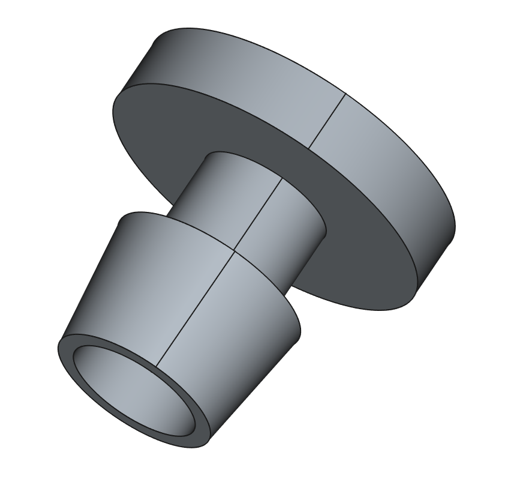

# Dripline Hole Plug – 3D Model (FreeCAD)

## Overview

This is a **3D model of a dripline hole plug**, designed in **FreeCAD** for use in agricultural and garden irrigation systems. The plug is intended to **seal unused emitter holes** on drip irrigation tubing (also known as dripline or drip tape), helping prevent water waste and maintain consistent system pressure.

## Use Case

In drip irrigation systems, emitter holes may become obsolete due to layout changes or emitter removal. This plug fits into those holes, offering a quick and effective seal.

## Key Features

* Designed for **standard emitter holes** (Ø 3–5 mm)
* **Reusable** and easy to insert by hand
* **Printable with most 3D printers**
* Compact, **friction-fit geometry**
* Created using **parametric modeling** in FreeCAD

## Files Included

* `plug.FCStd` – Native FreeCAD design file
* `plug.stl` – Ready-to-print 3D model
* `plug.3mf` – BambuStudio project file

## Recommended Print Settings (for FDM 3D printing)

| Parameter         | Value                           |
| ----------------- | ------------------------------- |
| Material          | PETG or ABS (UV-resistant)      |
| Layer Height      | 0.2 mm                          |
| Infill            | 100% recommended (for strength) |
| Supports          | Not needed                      |
| Print Orientation | Flat side down                  |

## Dimensions

* Plug Head Diameter: \~8 mm
* Plug Shaft Diameter: \~4 mm
* Total Length: \~9 mm

> ⚠️ Ensure compatibility with your specific dripline tubing before large-scale printing.

## License

This project is licensed under the **CC BY-SA 4.0** license. You are free to remix, adapt, and build upon this work, even for commercial purposes, as long as you credit the author and license your new creations under the same terms.

